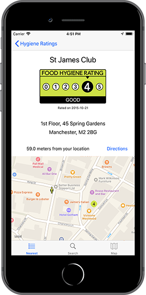

# Hygiene-Ratings-iOS

An iOS mobile application used to search and display hygiene ratings of venues across the United Kingdom.

## Functionality
- Display nearest 25 venues to the user's location displayed on a map or in a list view. 
- Venues are searchable by business name and postcode by using the search feature.
- Detailed view of venue information and directions from user location.

## TODO
- [ ] General
  - [ ] Add information section to application stating what each rating means.
- [ ] Testing
  - [ ] Add unit tests to test code.
  - [ ] Add tests to test UI elements and functionality.
  - [ ] Test functionality on numerous screensizes, I.e. various mobile screen sizes, tablets.

## Screenshots

